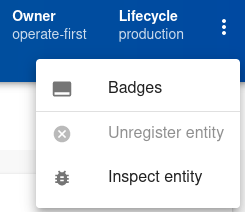

# Configuring catalog entities

Catalog entities are configurable through YAML definition files located [here][1]. Basic entity declaration is thoroughly described in [upstream documentation][2]. Please be aware that this source is a bare declaration and omits plugin and extension capabilities specific to Operate First instance. Read the following sections to fully understand all the available plugins.

When creating new entities [ADR 0022][16] should be followed.

## TechDocs plugin

TechDocs plugin publishes documentation for an entity. We use an upstream recommended setup, where documentation is built and bundled asynchronously to the service catalog deployment. As a result the configuration of this plugin for a new entity has 3 steps:

1. [Create the necessary file structure](#mkdocs) for your documentation.

2. A [GitHub workflow][10] is required on the repository that hosts the documentation source files. For a guide on how to [setup this workflow](#using-techdocs-workflow-template) check the subsection below.

3. Add an url reference to your entity definition. This url should point to the documentation source code and it is not used by the documentation builder but rather as a reference when user demands changes etc. See the example for an annotation below.

  ```yaml
  annotations:
      backstage.io/techdocs-ref: url:https://github.com/operate-first/service-catalog/tree/main/docs
  ```

### MkDocs

TechDocs plugin uses [MkDocs][12] as the builder. Your directory structure should look like the one bellow. For more information on how to setup MkDocs, follow [this guide][14].

```
docs/
├── index.md
mkdocs.yaml
```

This default setup above is the most common use case when you have one documentation per one entity repository. However it is also posible to have multiple documentations for multiple entities in one repository. Each documented entity has to be contained in one directory. See the example below:

```
service1/
├── docs/
│   └── index.md
├── mkdocs.yaml
docs/
├── index.md
mkdocs.yaml
```

Depending on which setup you chose the configuration of the workflow is different.

### Using TechDocs workflow template

A template can be found [here][9], after the template has been coppied uncomment this part:

```yaml
on:
  push:
    branches:
      - main
      - master
    paths:
      - "**/docs/**"
      - "mkdocs.yaml"
      - "mkdocs.yml"
```

since it will allow the workflow to run on any changes made to the documentation.

Next up define the steps for the workflow. Each step has to reference [this][11] action which is used to activate the build and publish process. A code snipped below explains how to use this action when your documentation is placed in the root of your repository:

```yaml
- name: Send dispatch for service-catalog
  uses: operate-first/service-catalog/.github/actions/docs-dispatch@main
  with:
    # Root of the repository
    docs_path: '.'
    # Name of your entity in the catalog
    entity_name: 'service-catalog'
    # Type of your entity in the catalog
    entity_kind: 'Component'
    # This can always be ${{ github.repository }}
    repository: ${{ github.repository }}
    # GitHub token that requires metadata:read and contents:read&write permissions to service-catalog repository
    token: ${{ secrets.SESHETA_TOKEN }}
```

If the documentation is not located in the root of the repository, a filter definition is required using [glob expresions][15]:

```yaml
- name: Send dispatch for service2
  uses: operate-first/service-catalog/.github/actions/docs-dispatch@main
  with:
    # Glob expression, filtering where your documentation root is
    filter: 'service2/**'
    # Directory path to your documentation folder relative to the repository root
    docs_path: 'service2'
    entity_name: 'service2'
    entity_kind: 'Component'
    repository: ${{ github.repository }}
    token: ${{ secrets.SESHETA_TOKEN }}
```

<!--Mermaid diagram showing techdocs architecture somewhere here -->
[Documentation reference][13]

## GitHub Insights/Security Insights

These GitHub specific plugins can display various GitHub content to the user. GitHub Insights renders a readme, contributors and such. Security Insights can display pending security advisories. Both plugins rely on a `github.com/project-slug` annotation presence in the entity definition.

```yaml
annotations:
    github.com/project-slug: operate-first/service-catalog
```

Both of these plugins (`GitHub Insights` and `Security Insights`) interface directly to GitHub on front-end. Therefore some information visibility is subjective to each user. In general following rules apply:

GitHub Insights plugin:

1. Repository is private
  1. User has access to the repository -> Content is visible to the user
  2. User doesn't have access to the repository -> Content is not visible to the user
2. Repository is public -> Content is visible to any user

Security Insights:

1. User is granted permissions to view security advisories -> Security insights are visible to the user

[Documentation reference for GitHub Insights][3]

[Documentation reference for GitHub Security Insights][4]

## ADR plugin

ADR plugin renders all ADRs present for given entity. It is configured via an annotation on the entity definition. Right now the only valid value for the annotation is a GitHub repository link to the folder which contains your ADRs, see the example below.

```yaml
annotations:
    backstage.io/adr-location: https://github.com/operate-first/blueprint/tree/main/adr
```

[Documentation reference][5]

## Grafana plugin

Grafana plugin can display links to Grafana dashboards and alerts on the overview page. It is configured via an annotation on entity declaration. This annotation describes which Grafana tag should be queried for dashboards and AlertManager tag for alerts.

```yaml
annotations:
    grafana/tag-selector: thoth
```

[Documentation reference][6]

## Kubernetes plugin

Kubernetes plugin allows you to see pod and deployment status for each entity. There are 2 possible ways available to map pods and deployments to Service Catalog entities:

1. Specify a label selector for Kubernetes entities `backstage.io/kubernetes-label-selector`

  Deployment manifest:

  ```yaml
  metadata:
    labels:
      app: my-app
      component: front-end
  ```

  Component definition:

  ```yaml
  annotations:
    backstage.io/kubernetes-label-selector: 'app=my-app,component=front-end'
  ```

2. Use `backstage.io/kubernetes-id` label on kubernetes entities and the same as an annotation on service catalog entity.

  Deployment manifest:

  ```yaml
  metadata:
    labels:
      backstage.io/kubernetes-id: service-catalog
  ```

  Component definition:

  ```yaml
  annotations:
    backstage.io/kubernetes-id: service-catalog
  ```

We prefer to use just plain kuberntes labels and the `kubernetes-label-selector`.

[Documentation reference][7]

## Badges plugin

This plugin provides a set of badges that can be used in your repository `README` or any other markdown files. They can be accessed via the dropdown menu when viewing an entity, see the picture below for guidance:



[Documentation reference][8]

[1]: https://github.com/operate-first/apps/tree/master/service-catalog
[2]: https://backstage.io/docs/features/software-catalog/descriptor-format
[3]: https://roadie.io/backstage/plugins/github-insights
[4]: https://roadie.io/backstage/plugins/security-insights
[5]: https://github.com/backstage/backstage/tree/master/plugins/adr
[6]: https://github.com/K-Phoen/backstage-plugin-grafana
[7]: https://backstage.io/docs/features/kubernetes/overview
[8]: https://github.com/backstage/backstage/blob/master/plugins/badges/README.md
[9]: https://github.com/operate-first/service-catalog/blob/main/.github/workflows/techdocs-template.yaml
[10]: https://docs.github.com/en/actions/using-workflows
[11]: https://github.com/operate-first/service-catalog/blob/main/.github/actions/docs-dispatch/action.yaml
[12]: https://www.mkdocs.org
[13]: https://backstage.io/docs/features/techdocs/techdocs-overview
[14]: https://www.mkdocs.org/getting-started
[15]: https://docs.github.com/en/actions/using-workflows/workflow-syntax-for-github-actions#filter-pattern-cheat-sheet
[16]: https://github.com/operate-first/blueprint/blob/main/adr/0022-rules-for-entity-mapping-in-service-catalog.md
